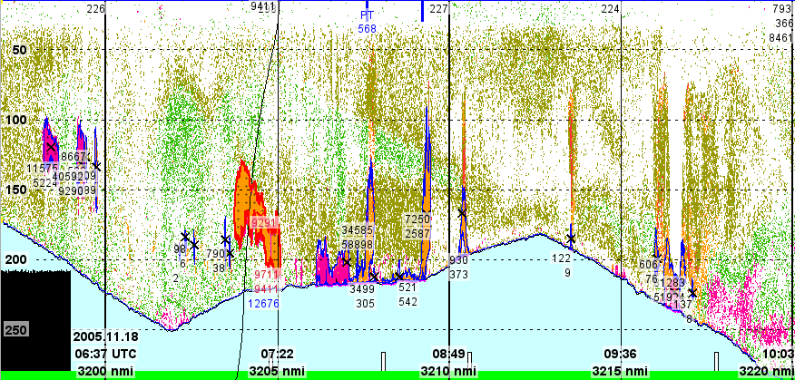

<!-- to build for JOSS:
     % docker run --rm --volume $PWD/docs:/data --user $(id -u):$(id -g) --env JOURNAL=joss openjournals/inara
	   or for Arxiv:
	 pandoc -s --citeproc --bibliography paper.bib paper.md -o paper.tex
-->

# Summary

KoronaScript is a Python library that provides a programmatic interface to KORONA. KORONA is a library that contains a wide collection of algorithms and processing modules for acoustic data processing.  KORONA is integrated with the Large Scale Survey System (LSSS) [@korneliussen2006large], a Java based application for scientific analysis of data from acoustic equipment, including echo sounders, sonars, and hydrophones.

# Statement of need

Acoustic instruments have become essential tools for marine science, and a variety of echo sounders and sonars are routinely used to explore the world below the ocean surface.  Multi-beam echo sounders map the sea floor in high detail, split beam and multi frequency echo sounders measure the abundance of fish for stock assessments, side-scan and synthetic aperture sonars can resolve objects in minute detail, ACDP measures deep sea currents.

In parallel with the development and new and more advanced instruments, there has risen a need for algorithms and tools to effectively process the often large amounts of data produced.  Software analytics are important for tasks like noise detection and removal, data compression, bottom detection, species identification and other acoustic target classification, and integrating with related data.  Several popular software packages exist, often combining a variety of analytics with an easy to use graphical interface, including LSSS [@korneliussen2006large], HERMES and Movies3d [@trenkel2009overview], and EchoView [@EchoviewSoftware].

While interactive scrutiny by expert users remains an important method to interpret acoustic data, it is often convenient or even necessary to automate the processing.  As data collection volumes increase, labor costs and expert availability becomes major obstacles to effective data use.  Having a programmatic interface that can be scripted is quickly becoming a necessity.

Furthermore,  many important algorithms and processing modules have many tunable parameters, and a scriptable API allows these parameters to be optimized by an automated (or semi-automated) process using grid search or other schemes.  The other user can perform sensitivity analysis to evaluate the importance of each parameter, and can compare the results from different configurations to find the process that best fits a particular challenge.

Finally, by embedding the analysis in a program, it can be shared, copied, and versioned (e.g.\ in GitHub), which supports reproducibility and verifiability, and is particularly useful for scientific work. The process can also be  intermixed with other processing operations, like AI-based classification models [e.g., @brautaset2020acoustic], or functionality offered by other analysis toolkits like PyEchoView [@wall2018pyecholab] or EchoPype [@lee2024interoperable].

_KoronaScript_ is a Python application programming interface (API) that interfaces with KORONA, the processing components of the popular acoustic analysis package, LSSS.  This gives the user full programmatic access to all the processing modules and algorithms offered by KORONA through a convenient Python interface.

# State of the field

Traditionally, interpreting marine acoustic data for scientific or resource management purposes have been performed by manual scrutiny by experts using interactive tools. <!-- [@korneliussen2006large, @trenkel2009overview] -->
This approach has been a cornerstone for important long running survey series performed by research institutes, examples include the Institute of Marine Research in Norway using LSSS, IFREMER in France using Movies3d, and NOAA in the US using EchoView.  <!-- @Rolf -->

To support post-processing of data and scientific information extraction, some programmatic packages exist, including
EchoeViewR [@harrison2015r], which provides an R interface to the EchoView system, and Matecho [@perrot2018matecho], a tool for data analysis implemented in Matlab, and linked to Movies3d [@trenkel2009overview].

With the advent of uncrewed platforms for data collection [@handegard2024usvs], the need to build automated workflows automatically has increased. Increased data complexity and volumes, e.g. from broadband echo sounders, exacerbates this [@guidi2020big;@malde2020machine].
To automate data processing, there exist packages like PyEchoLab [@wall2018pyecholab] and EchoPype [@lee2024interoperable] which offer algorithms and tools with a programmatic interface.

<!-- However... -->

Simultaneously, the advent of deep learning in marine science [@malde2020machine;@beyan2020setting;@rubbens2023machine] has increased the importance of integrating traditional or existing methods with new, data driven approaches.
Although support for machine learning can be found in many programming languages (including Matlab and R), Python is overwhelmingly the most popular choice.  We foresee that the field will increasingly move towards automation that integrates traditional and new methods using Python as the primary glue.

# Software design

## LSSS and KORONA

The Large Scale Survey System (LSSS) [@korneliussen2006large] is an efficient open source tool for analyzing data from acoustic trawl surveys. The system is designed to support the standard workflow for acoustic trawl surveys where the data is manually curated during the survey, using an interactive interface shown in Figure \ref{fig:example_LSSS}. The system contains support for reading a wide range of data formats, a graphical interface to manually assign acoustic backscatter to acoustic categories as well as an echo integration step for estimating the nautical scattering coefficient per acoustic category for further use in survey estimation programs like StoX [@johnsen_stox_2019]. The software is the *de facto* standard for all acoustic trawl surveys conducted by the Institute of Marine research. 
<!-- Other users are the MRI , Iceland (ask rolf for more) -->

LSSS integrates with a preprocessing library called KORONA. KORONA is used to process the data before using the data in LSSS.
The library is comprised of a number individual modules (see Table \ref{tbl:ksmod} for the full list), offering access to a wide range of functionality and algorithms, including noise removal, broadband pulse compression, tracking, automated target classification (see Figure \ref{fig:example_KORONA}), format conversions, etc.
In addition to the integration with the LSSS platform, KORONA also provides its own graphical user interface for configuring and orchestrating them. The standard output from KORONA uses a data format based on extending the raw data format used by Kongsberg, but the library also offer data conversion, and supports importing from and and exporting to NetCDF.

| List of modules          |                         |                              |
|--------------------------|-------------------------|------------------------------|
| AngleDeletion            | ErodeLowValues          | PulseCompressionFilter       |
| BroadbandNotchFilter     | Erode                   | RemoveBottom                 |
| BroadbandSplitter        | Expression              | Rescale                      |
| BubblSpikeFilter         | FillMissingData         | SchoolCategorization         |
| Categorization           | Filter3X3               | SchoolDetection              |
| CdsViewer                | FiskViewDisplay         | Smoother                     |
| ChannelDataRemoval       | GroupEnd                | SpikeFilter                  |
| ChannelRemoval           | HorizontalOffsetCorrect | SpotNoise                    |
| Combination              | Isolation               | TemporaryComputationsBegin   |
| Comment                  | Median                  | TemporaryComputationsEnd     |
| ComplexToReal            | NetcdfWriter            | ThresholdAllChannels         |
| DataReduction            | NoiseAcceptance         | Threshold                    |
| DepthDependentResampling | NoiseMedianQuantificati | TimeInterval                 |
| Depth                    | NoiseQuantification     | Towfish                      |
| Dilate                   | NoiseRemover            | TrackFilter                  |
| Downsampling             | NoiseVisualization      | Tracking                     |
| ES60Correction           | PingCollapsing          | TsDetection                  |
| EchoLineCompression      | PingThinning            | VerticalOffsetCorrection     |
| EdgeDetection            | PlanktonInversion       | Writer                       |
| EmptyPingRemoval         | Plugin                  |                              |
: The set of modules offered in the current version of KORONA, and thus available for use in Python programs with KoronaScript.\label{tbl:ksmod}

## The KoronaScript programmatic interface

KoronaScript is implemented as a set of Python classes that each encapsulates a KORONA processing module.  These classes leverage two core features offered by KORONA.
First, KORONA can generate a description of its modules and their parameters in the form of a JSON file.  KoronaScript parses this, and generates the corresponding Python classes.  This ensures that the KoronaScript will automatically incorporate new features provided by new releases of KORONA.

Second, the KORONA user interface writes configured pipelines to XML files, which are then processed by the corresponding processing modules.  KoronaScript leverages this interface by having the classes generate the same XML output as the KORONA GUI would produce.  A `KoronaScript` class lets the user organize class instances in a sequence, and calling the KORONA processing infrastructure on the generated XML specification.

## Availability and installation

KoronaScript is available from the PYPI archive, and can be installed using `pip install koronascript`, or via other package management tools for Python (e.g. Anaconda or `uv`).  The source code is available from the GitHub repository at https://github.com/CRIMAC-WP4-Machine-learning/CRIMAC-KoronaScript .

KoronaScript will automatically download KORONA, LSSS, and the required Java runtime from the official web site and install them in a default location, so no explicit action is required by the user.
If a separate installation to a user defined location is preferred, the latest version of the software can be downloaded from https://marec.no/downloads.htm or from the GitHub repository at https://github.com/marec-open-source/lsss .
The environment variable `LSSS` must then be configured to point to the installation of these packages for KoronaScript to utilize them.

# Research impact statement

KORONA and LSSS have grown in popularity over time, and before it was released as Open Source been licensed for use by 22 institutes and other organizations[^1]. 
At the Institute of Marine Research, LSSS is used to process acoustics data from more than sixty surveys per year, 
and KORONA functionality is instrumental for acoustic target classification, noise filtering, data regridding, and format conversion.

[^1]: https://www.norceresearch.no/en/news/our-acoustic-analysis-system-for-fish-is-becoming-open-source

KoronaScript makes the analyses easily available programmatically, and enabling systematic exploration of methods and parameters and facilitating deployment in new settings including on UAVs and in the cloud.
At IMR, KoronaScript is rapidly becoming an indispensable tool for automating processing pipelines, and restructuring and ingestion of historical data for developing new machine learning methods.

# AI usage disclosure

A large language model was used to review drafts and offer suggestions for text improvement. All suggestions were manually reviewed.  AI has not been used for direct generation of code or text.

# Acknowledgments

# References
